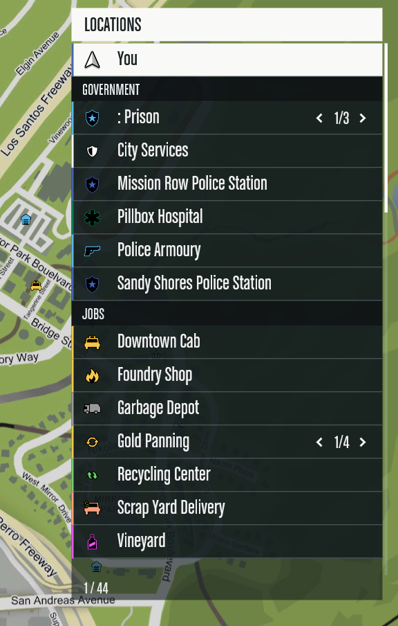
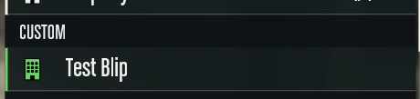

# Native map legend — grouped Locations panel

An edited GTA V Enhanced Scaleform using the game's blip data and callbacks, without NUI or a client loop.

For everyday use, name a blip **`[CATEGORY] Location Name`** in the resource that creates it. The legend displays **Location Name** under **CATEGORY**. If there is no valid tag, the legend chooses a category using the keyword rules below.

## How it works

1. Your existing resources create the actual map blips: coordinates, icons, colors, names, and native grouping.
2. GTA sends the pause-map legend its location slots. This resource reads those slots; it does not scan or edit the other resources' configs.
3. The legend checks the player/waypoint entries, then a `[CATEGORY]` tag, then fallback keywords.
4. It builds a separate display order and draws headings above each group. The original slot IDs remain intact for selection, map navigation, and cycling grouped locations.

Categories are **section headings in one scrolling list**, not clickable tabs. Up/down moves between locations and skips headings. Left/right cycles a selected location when GTA supplies multiple blips in that entry. Mouse selection still uses the original native slot ID.

This resource changes the map UI's presentation. Adding a tag does not create a new map location, set coordinates, choose an icon, or split a native grouped entry into separate rows. A `1/6` counter still represents the locations GTA supplied for that entry.

## Try it

If the resource is already running, use the server console:

```text
restart aj-map-legend
```

For the first start:

```text
refresh
ensure aj-map-legend
```

Fully restart FiveM and reconnect to unload the previously cached frontend movie. No server configuration was changed; the current configuration does not automatically start `[dev]`.

## Appearance and grouping



*General map UI: the Locations panel with category headings and native location cycling.*

- A fixed-width **Locations** panel with a white header, continuous dark rows, fine separators, and a white selected row.
- Icons on the left; larger condensed labels alongside them. Long labels shrink slightly, then ellipsize to stay inside the panel.
- The player entry is labeled **You** and sorted first, followed by the waypoint when present.
- Non-selectable section headings: **Government**, **Jobs**, **Vehicles**, **Shops & Services**, **Activities**, **Properties**, **Other**.
- Entries sort alphabetically within each section. Categories without entries are omitted. A category heading repeats at the top when scrolling into the middle of that section.
- Grouped location counters remain on the right, with the native left/right cycling behavior.
- A visual-order position count and thin scrollbar replace the native footer count.
- A large white uppercase condensed area name with simulated extra weight at the top left, aligned with the screen's safe margins. GTA still supplies the live name as you browse the map.
- The bottom-left distance ruler and its numbers are hidden, along with the old area-name background.

This pass implements the grouped panel and player label from the reference, without a search field or checkbox controls. Existing native visibility callbacks remain available.

The area title and distance ruler are part of the same `pause_menu_pages_map.gfx`; no additional streamed movie is needed. `PAUSE_MENU_PAGES_MAP.setDisplayConfig()` anchors the title to the top safe margin in fullscreen map mode. `PAUSE_MENU_MAP.SET_TITLE()` styles the live label with the shared `$Font2_cond_NOT_GAMERNAME` font at size 32 (Scaleform units), and both title and distance callbacks keep the ruler hidden. The title is the game's area name, not a hardcoded name or a blip category. The screenshots above focus on the Locations panel.

### Fonts

The area title uses the same `$Font2_cond_NOT_GAMERNAME` font already rendering in the Locations panel. A second white text field offset horizontally by 0.75 Scaleform units adds weight without requesting an unavailable bold or italic face. This is simulated weight, not a separate bold font. Both fields receive the same live text and formatting, reuse their display objects, and hide together when the area name is empty. The Locations panel keeps its existing styling.

A font mapping alone does not prove that the map has loaded its glyphs. For example, `$HelveticaBLKI` exists in `common/data/ui/fontmap.xml`, but the installed `font_lib_efigs_pc.gfx` has no Helvetica face among its nine font definitions; using it here produced missing-glyph boxes. The condensed face used here is present in that library, with bold/italic flags explicitly disabled. Before switching fonts, verify the actual font library and style, then test rendering in-game.

To change this heading, edit the `TextFormat` in `PAUSE_MENU_MAP.SET_TITLE()`, update the corresponding font expectation in `test-layout.cjs`, and rebuild. Names must resolve to fonts available to the game. Installing a TTF on the server or putting it beside the GFX is not enough. A custom font requires embedding/exporting its glyphs in a Scaleform font library (or the movie) and making that font available to the map. This resource currently uses built-in fonts only; no custom-font loader is included. See [Scaleform font libraries and mapping](https://help.autodesk.com/cloudhelp/ENU/Scaleform-Help/scaleform_help/font/part_2.html).

## Dynamic category tags



*Custom category example: `[CUSTOM] Test Blip` displays as **Test Blip** beneath the **CUSTOM** heading.*

Set the blip's name in its existing resource/config to a string like:

| Blip name | Heading | Visible row label |
| --- | --- | --- |
| `[VEHICLES] Hayes Depot` | VEHICLES | Hayes Depot |
| `[GOVERNMENT] City Hall` | GOVERNMENT | City Hall |
| `[FOOD] Burger Shot` | FOOD | Burger Shot |
| `[MEDICAL] Pillbox Hospital` | MEDICAL | Pillbox Hospital |

Any non-empty tag creates a group automatically; new categories do **not** require editing or rebuilding the Scaleform. Tags override keyword matching. Names are trimmed and categories are case-insensitive: `[ vehicles ]` merges with `[VEHICLES]`. GTA prefixes such as `Garages: [VEHICLES] Hayes Depot` are supported too. The parser removes the prefix only from the displayed legend label; the original slot data and name remain untouched.

### Add or rename a custom spot

1. Find the resource/config that creates the blip. For a new spot, add the location using that resource's normal configuration, including its coordinates and other required settings.
2. Set the field that becomes the actual **blip name** to `[CATEGORY] Location Name`. Field names differ between resources; changing a resource's general title does not necessarily change its blip name.
3. Reload or restart the resource that owns the blip using its normal workflow so it recreates or renames the blip.
4. Open/reopen the pause map. When GTA sends the updated slot, the legend creates the group and removes the tag from the displayed name.

For example, this server's `qbx_garages` reads `accessPoint.blip.name`, falling back to the garage's `label`. In `[qbx]/qbx_garages/config/server.lua`, an existing access point can use:

```lua
blip = {
    name = '[VEHICLES] Hayes Depot',
    sprite = 357,
    color = 3,
},
```

This is just the blip portion of a garage's configuration, not a complete new garage definition. Keep the location's existing coordinates and other required fields. Using `blip.name` lets the garage's separate general `label` remain unchanged.

The legend has no registration export or central list of custom spots. To introduce an entirely new category, use it in a name—for example, `[BUSINESSES] Hayes Auto`. The **BUSINESSES** heading appears when that entry reaches the legend. It disappears when no supplied entries use it.

### Tag parsing rules

| Input name | Result |
| --- | --- |
| `[VEHICLES] Hayes Depot` | VEHICLES → Hayes Depot |
| `[vehicles] Hayes Depot` | Same VEHICLES group |
| `[ vehicles ]  Hayes Depot` | Outer spaces trimmed; same group and label |
| `Garages: [VEHICLES] Hayes Depot` | VEHICLES → Hayes Depot; GTA's leading category is removed too |
| `Stores: [FOOD] Burger Shot` | FOOD → Burger Shot, overriding the `store` fallback match |
| `[MEDICAL] Hospital` | MEDICAL → Hospital, overriding the Government fallback |
| `[VEHICLES]Hayes Depot` | Accepted; a space after `]` is recommended for readability |
| `Hayes [VEHICLES] Depot` | Not a prefix; brackets stay in the name and keyword matching applies |
| `[] Hayes Depot` or `[  ] Hayes Depot` | Empty tag ignored; name retained and keyword matching applies |
| `[VEHICLES Hayes Depot` | Missing closing bracket; name retained and keyword matching applies |
| `[VEHICLES]` | No location name; tag is not consumed |
| `[VEHICLES] [PUBLIC] Hayes Depot` | Only the first tag is read; `[PUBLIC] Hayes Depot` remains the label |

The parser recognizes a leading tag, or a tag immediately after the first colon and optional whitespace, as in GTA's `Garages:` prefix. It does not search arbitrary positions inside a name. It removes `<C>`/`</C>` name-formatting markers before parsing.

Category names are trimmed and converted to uppercase. Interior spaces and punctuation are preserved: `[FOOD SPOTS]` and `[FOOD  SPOTS]` are different groups. Keep category names consistent and concise. Prefix removal applies to this map legend; other UI that uses the original blip name may still display the tag.

Existing predefined groups keep their order. Additional custom groups sort alphabetically after those groups, before **Other**. Rows sort by their visible name. Empty/malformed tags remain visible as ordinary text. A tag without a location name, such as `[VEHICLES]`, is not consumed. Player and waypoint retain their special placement, and the player stays **You**.

### Category display order

1. **You**, then the waypoint if present—without a category heading.
2. **GOVERNMENT**
3. **JOBS**
4. **VEHICLES**
5. **SHOPS & SERVICES**
6. **ACTIVITIES**
7. **PROPERTIES**
8. Additional tagged categories, alphabetically—for example **BUSINESSES**, **FOOD**, **MEDICAL**.
9. **OTHER**

An explicit tag matching a predefined group joins that group: `[VEHICLES]` does not create a second Vehicles section. Only categories containing locations are drawn. Entries are sorted case-insensitively by the parsed name, with a valid tag removed; identical names retain native slot order. For untagged entries, GTA's category prefix can still be part of the sort key even where the row renderer hides a `Garages:` or `Los Santos Customs:` prefix.

## Automatic keyword matching

Without a valid tag, `categoryFor()` lowercases the full incoming label and looks for **substrings**. Matching is case-insensitive, does not require whole words, and is not a regular expression. GTA's leading category text is included in this check.

The **first matching row in the following table wins**. This matching order differs from the category display order above. Vehicles has an early specific check and a later general check so that, for example, a garbage depot goes under Jobs rather than Vehicles.

| Match priority | Category | Substrings checked |
| --- | --- | --- |
| 1 | GOVERNMENT | `police`, `sheriff`, `hospital`, `medical`, `ambulance`, `prison`, `jail`, `court`, `city hall`, `city services`, `government`, `dmv`, `ranger`, `fire station` |
| 2 | VEHICLES — specific | `garages:`, `customs`, `mechanic`, `impound`, `car wash`, `carwash`, `dealership`, `vehicle shop`, `vehicle sales`, `car rental`, `air shop` |
| 3 | JOBS | `garbage`, `recycl`, `panning`, `mining`, `quarry`, `lumber`, `butcher`, `farm`, `vineyard`, `trucker`, `trucking`, `shipping`, `delivery`, `postal`, `courier`, `taxi`, `downtown cab`, `bus depot`, `foundry` |
| 4 | SHOPS & SERVICES | `bank`, `atm`, `ammunation`, `ammu-nation`, `gun shop`, `barber`, `clothing`, `tattoo`, `store`, `shop`, `market`, `pawn`, `restaurant`, `cafe`, `diner`, `burgershot` |
| 5 | ACTIVITIES | `diving`, `fishing`, `hunting`, `crafting`, `golf`, `casino`, `race`, `racing`, `gym`, `bowling`, `arcade`, `tennis`, `cinema`, `beach` |
| 6 | VEHICLES — general | `garage`, `depot`, `parking`, `airport`, `helipad`, `hangar`, `hanger`, `dock` |
| 7 | PROPERTIES | `apartment`, `property`, `properties`, `house`, `housing`, `motel`, `hotel`, `plaza`, `real estate` |
| No match | OTHER | Everything that did not match an earlier rule |

Examples:

| Untagged name | Category | Reason |
| --- | --- | --- |
| `Garbage Depot` | JOBS | `garbage` wins before the general `depot` rule |
| `Foundry Shop` | JOBS | `foundry` wins before `shop` |
| `Hospital Gift Shop` | GOVERNMENT | `hospital` is checked first |
| `Recycling Center` | JOBS | The substring `recycl` matches `recycling` |
| `Hayes Depot` | VEHICLES | General `depot` match |
| `Fantastic Plaza` | PROPERTIES | `plaza` match |
| `Mystery Location` | OTHER | No matching substring |

Substring matching can produce unintended matches—for example, `farm` also matches a longer word containing those letters. Use a tag when a location must belong to a particular group. `[FOOD] Hospital Gift Shop` explicitly belongs to **FOOD**, regardless of its fallback keywords.

The player (`radar_centre`) and waypoint (`radar_waypoint`) are special entries identified by their icon linkage, not by their text. They keep their first positions regardless of tags. Only the player entry is renamed **You**.

Untagged names continue to use `categoryFor()` keyword matching in `PauseMenuMapView.as`; unmatched entries remain in **Other**. Tags are presentation groups, not changes to Lua blip category IDs. Existing resource blip names have not been renamed automatically. The list updates when GTA supplies a new/updated slot; reopen the map if needed after changing a blip name.

The renderer reapplies the shared font and text color after assigning each category heading and footer label so dynamically updated text retains its glyphs and formatting.

## Updating names versus rebuilding the UI

| Change | What to reload | Rebuild the Scaleform? |
| --- | --- | --- |
| Add a spot or rename a blip | Its owning resource, then reopen the map | No |
| Add/change a `[CATEGORY]` tag | Its owning resource, then reopen the map | No |
| Introduce a new custom tagged category | Its owning resource, then reopen the map | No |
| Change fallback keywords, default category order, parsing, fonts, or layout | Build, restart `aj-map-legend`, then fully restart FiveM | Yes |
| Edit this README | Nothing | No |

There is no automatic watcher for other resources' config files. Saving a new name in a Lua file only affects the legend after the owning resource applies it and GTA supplies updated legend data. The custom display order is rebuilt when slots are added or updated; changes do not require modifying the original native slot IDs.

### Troubleshooting

| Symptom | Check |
| --- | --- |
| A tag still appears in the row | Ensure it is at the beginning or immediately after GTA's first category colon, has a closing `]`, and has a non-empty location name afterward. Also confirm the new Scaleform version is loaded. |
| A tagged blip goes under the old category | Confirm you edited the field used for the actual blip name and that the owning resource recreated/renamed the blip. Some resources use a separate `blip.name` or a localized label. |
| Two nearly identical category headings appear | Case and outer spaces are normalized, but interior spaces, punctuation, singular/plural forms, and spelling are not. Use the same tag everywhere. |
| A custom category does not appear | It needs at least one entry in GTA's supplied legend. The tag alone does not create a blip or make a hidden blip visible. |
| An untagged blip is in an unexpected category | Check the first matching substring in the priority table, or give it an explicit tag. |
| A new location is part of a `1/N` entry | Native blip grouping is still in effect. Tags organize the entries GTA supplies; they do not change native grouping rules. |
| The UI still shows an older layout after an update | Restart `aj-map-legend`, fully exit FiveM, then reconnect to unload the cached frontend movie. |

## Source and build

Original extracted read-only with the installed CodeWalker Core library from:

```text
X:\SteamLibrary\steamapps\common\Grand Theft Auto V Enhanced\update\update.rpf
  x64\data\cdimages\scaleform_generic.rpf\pause_menu_pages_map.gfx
```

The repository keeps one set of source files and one exported movie:

```text
src/
  base/pause_menu_pages_map.gfx   # Original movie used as the build template
  scripts/__Packages/            # Editable ActionScript classes
stream_enhanced/
  pause_menu_pages_map.gfx        # Built movie loaded by FiveM Enhanced
docs/images/                     # README screenshots
build.ps1                        # Build and verification
test-layout.cjs                  # Source and compiled-code checks
fxmanifest.lua                   # FiveM resource manifest
```

Keep `src/base/pause_menu_pages_map.gfx`: it supplies the original symbols, shared imports, and untouched scripts when JPEXS imports the edited classes. It is a required build input, not a version snapshot. The output stays in `stream_enhanced` because this resource targets Enhanced. Git history replaces local backup/version folders.

The five edited classes under `src/scripts` are:

- `PAUSE_MENU_MAP.as`: native input routing, display setup, original footer suppression, area-title styling and distance-ruler suppression.
- `PAUSE_MENU_PAGES_MAP.as`: fullscreen area-title placement using the top and left safe margins.
- `PauseMenuMapItem.as`: row styling, label fitting, **You**, icons and cycling callbacks.
- `PauseMenuMapView.as`: group rules, display order, headings, scrolling and native-index mapping.
- `PauseMenuMapModel.as`: native slot updates routed through the grouped view.

Run `build.ps1` in PowerShell using the installed Java, JPEXS CLI, and Node. `-JpexsJar` supports a different JPEXS path. Only `stream_enhanced/pause_menu_pages_map.gfx` is streamed. This resource targets Enhanced.

From the resource directory in PowerShell:

```powershell
.\build.ps1
```

To use another JPEXS installation:

```powershell
.\build.ps1 -JpexsJar 'C:\Tools\FFDec\ffdec-cli.jar'
```

The default JPEXS path is `C:\Program Files (x86)\FFDec\ffdec-cli.jar`; `java` and `node` must be available on PATH. A successful build replaces the streamed file only after its checks pass.

For developers, `parseLabel()` handles tags, `categoryFor()` defines fallback keywords, `groupFor()` merges/creates categories, and `rebuildOrder()` applies category precedence and sorting in `PauseMenuMapView.as`. The predefined names are initialized in the constructor and reset in `rebuildOrder()`; the rank calculation controls where custom categories and **Other** appear. Update all relevant pieces together when changing default category order. Ordinary tagged categories do not need these source edits.

## Verification

The build runs `test-layout.cjs` twice: on the editable AS2 source, then on AS2 decompiled from the compiled candidate. Both passes execute the view's algorithms and map callbacks in a JavaScript harness. It checks category ordering, native slot identity, all selections across a 72-entry list, forward/backward wraparound, header and row bounds, live updates, cycling state persistence, player-label replacement, dynamic category tags, malformed tags, live recategorization, heading formatting, and empty/single-entry lists. It also checks changing/empty area names, reapplying title formatting, keeping the ruler hidden through title/distance updates, top-left safe-zone placement, and restoring normal page coordinates outside fullscreen. It does not emulate GFx rendering or the game's input dispatch.

JPEXS compiles the result and exports its bytecode. Build checks require explicit accessor calls for data, selection, and IDs, preventing the earlier `NaN` regression.

JPEXS 23 can omit initializers in AS2 `for(var ...)` loops. Use explicitly initialized `while` loops for counted iteration. The build checks code recovered from the compiled movie because source-only tests cannot catch compiler omissions.

Source and compiled-code checks also cover synchronized text/formatting in both area-title layers, reuse of the extra field, and hiding both layers for empty names. The current appearance has been confirmed in-game. Automated checks do not emulate GFx rendering: future UI changes still need checks of font rendering, long labels, navigation, cycling, map reopening, and safe-zone settings in-game.

## Rollback

Use Git history to restore a previous committed revision, keeping its source, build tooling, and exported movie together. Commit source changes and the rebuilt `stream_enhanced/pause_menu_pages_map.gfx` together after verification. After deploying a restored movie, restart the resource and fully restart FiveM to unload the cached frontend movie.
